# 🎵 MELO Music App

MELO Music App is a modern Android music streaming application built with **Kotlin** and **Jetpack Compose**, using **Firebase** as the backend. The app focuses on a smooth listening experience, a clean UI, and basic role management (User / Admin).

- Status: In development
- Platform: Android
- Language: Kotlin
- UI: Jetpack Compose
- Architecture: MVVM (Model – View – ViewModel)
- Backend: Firebase (Auth, Firestore, Storage)

## 📌 Overview
MELO Music App allows users to browse, search, and listen to music. The app supports two main roles: **User** and **Admin**.  
Users can explore categories, play songs, manage favorites, and view the Now Playing screen. Admins can manage content (add, edit, delete categories, songs, podcasts).

## 🎯 Project Goals
- Build a modern Android app using Jetpack Compose
- Apply MVVM architecture
- Practice Firebase integration (Auth, Firestore, Storage)
- Implement basic music playback features
- Role-based access control (User / Admin)
- Organize the project for maintainability and extensibility

## 👥 Roles & Features

### 🎧 User
- Register / Sign in
- Browse music categories
- Search songs, artists, and podcasts
- Music playback (play / pause / next / previous)
- Seek forward / backward during playback
- Now Playing screen
- Add songs to favorites
- View charts / trending lists
- Share content
- Manage user profile

### 🛠 Admin
- Sign in as an admin
- Create / edit / delete music categories
- Create / edit / delete songs
- Create / edit / delete podcasts
- Manage metadata (title, artist, image, audio URL)

## 📱 Main Screens
- Home: Featured, categories, suggestions
- Search: Search songs, artists, podcasts
- Share: Share content
- Chart: Trending / popular music
- Play (Now Playing): Playback screen
- Profile: User info and settings

## 🧱 Architecture (MVVM)
- Model: Data classes and repositories that interact with Firebase
- View: Screens implemented with Jetpack Compose
- ViewModel: Business logic, state management, and connecting Model <-> View

This architecture keeps the codebase clear, testable, and maintainable.

## 📂 Suggested Project Structure

```text
app/
├── data/
│   ├── model/         # Data models
│   └── repository/    # Firebase repositories
├── ui/
│   ├── home/
│   ├── search/
│   ├── chart/
│   ├── play/
│   ├── profile/
│   └── admin/
├── viewmodel/         # ViewModels
├── navigation/        # Navigation graph
└── MainActivity.kt
```

## 🛠 Prerequisites (Before Running)
- Android Studio (latest recommended)
- Android SDK
- Firebase project

## ▶️ Installation & Run

1. Clone the repo:
```bash
git clone https://github.com/ancoldly/melomusic.git
cd melomusic
```

2. Open the project in Android Studio:
- Import the project, sync Gradle.
- Run on an emulator or physical device.

3. Configure Firebase:
- Create a Firebase project in the Firebase Console.
- Enable Authentication (Email/Password or other providers as needed).
- Create a Firestore Database (choose test or production rules depending on needs).
- Enable Firebase Storage for storing images and audio files.
- Download the `google-services.json` file from Firebase Console and place it in the `app/` directory.

4. Configuration:
- Verify Firebase configuration in the `build.gradle` (app module).
- If the project uses environment variables or additional secrets (e.g., remote config), configure them according to the README or internal docs.

5. Run:
- From Android Studio: Run -> app
- Or use Gradle:
```bash
./gradlew assembleDebug
```

## 🚀 Future Improvements & Suggestions
- User-managed playlists
- Offline downloads
- Improve streaming performance (buffering, caching)
- Dark theme support
- Notification and lock-screen playback controls
- Recommendation engine / personalized suggestions

## 🧾 Suggested Firebase (Firestore) Schema
- Users: User profiles and role information
- Categories: Music categories
- Songs: Song documents (title, artist, imageUrl, audioUrl, categoryId, metadata)
- Podcasts: Podcast documents
- Favorites: User favorite songs

## 🤝 Contributing
- Fork the repository, create a feature/ or bugfix/ branch, and open a PR describing your changes.
- Follow Kotlin and Jetpack Compose best practices.
- Open an issue with a clear description when reporting bugs.

## Screenshots / UI mockups

<p align="center">
  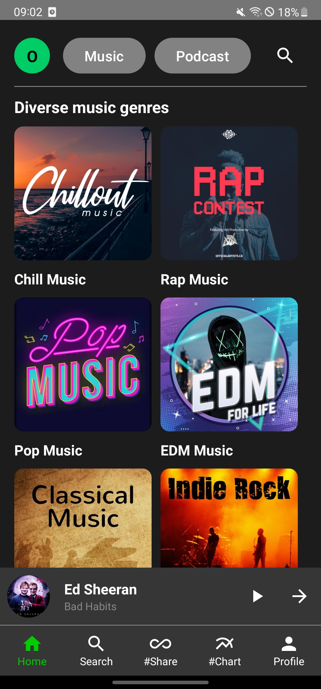
  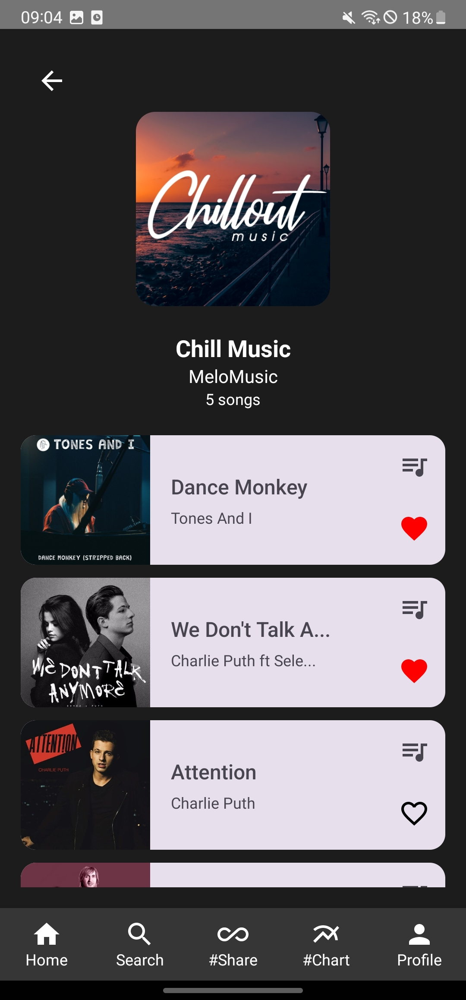
  
</p>

<p align="center">
  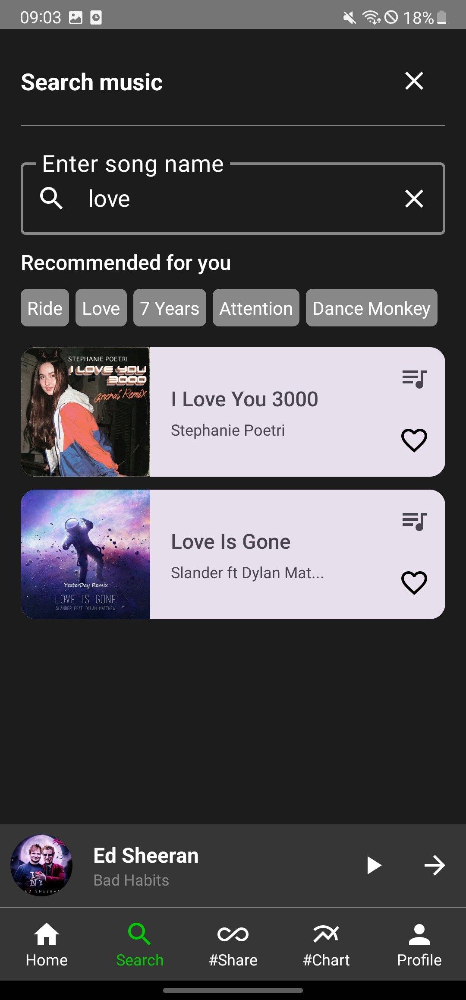
  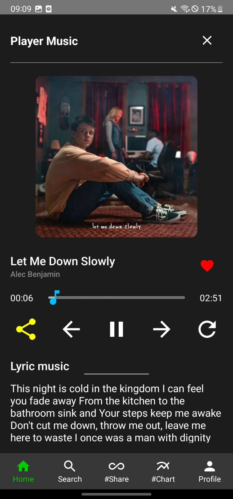
  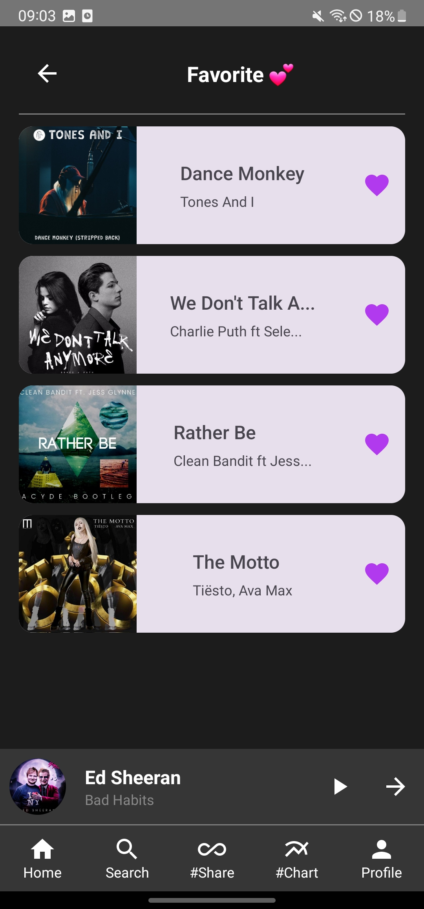
</p>

<p align="center">
  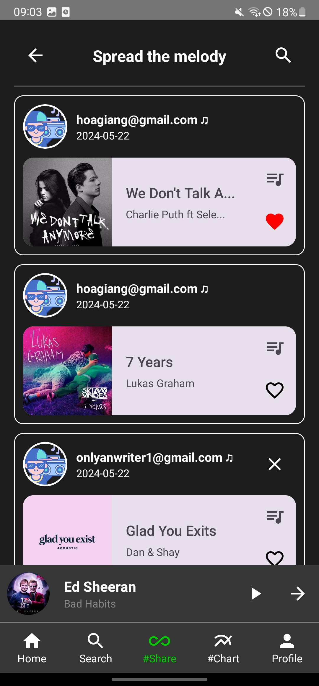
  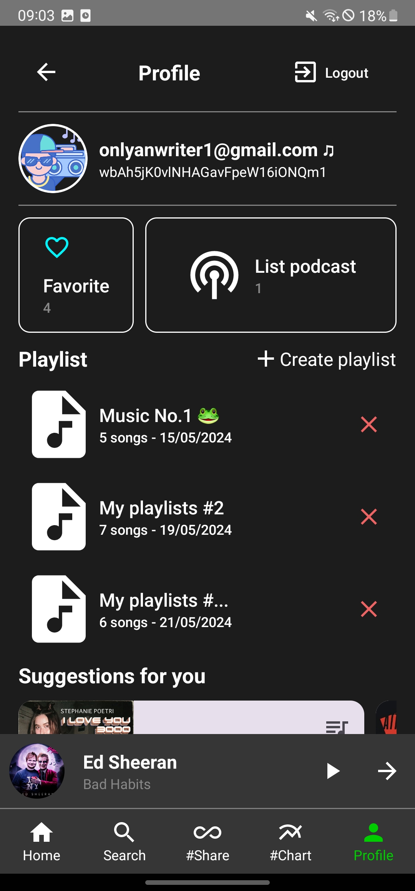
  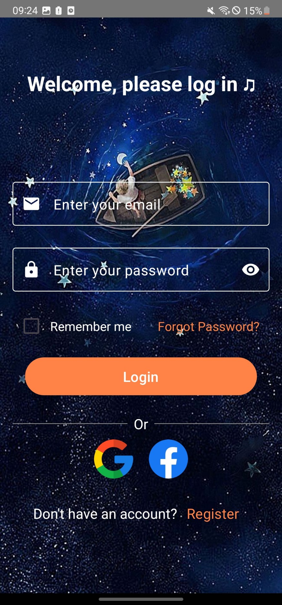
</p>

<p align="center">
  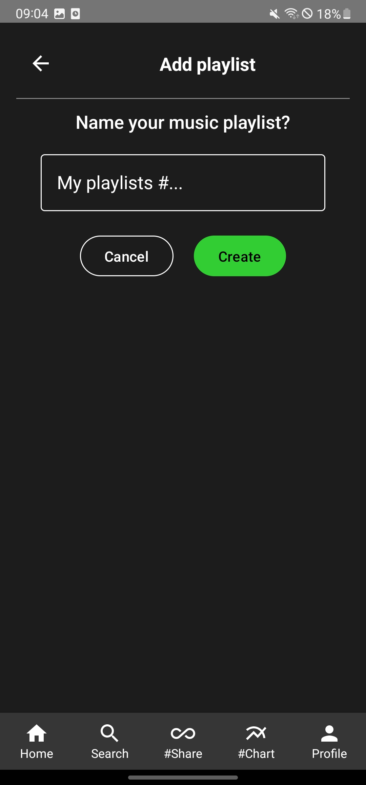
  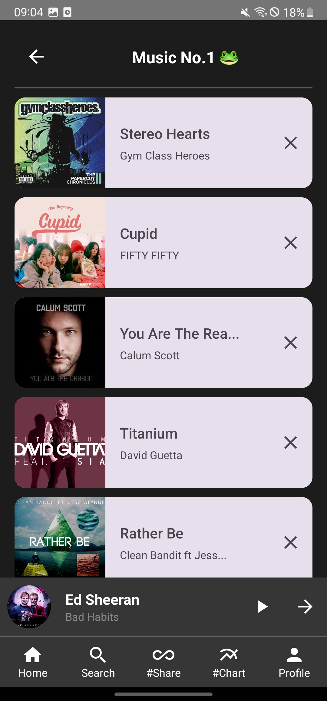
  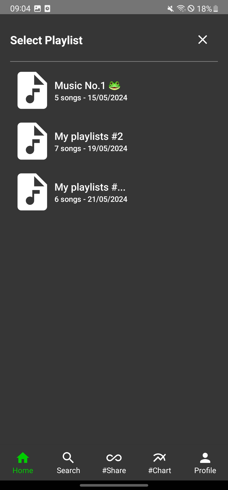
</p>

<p align="center">
  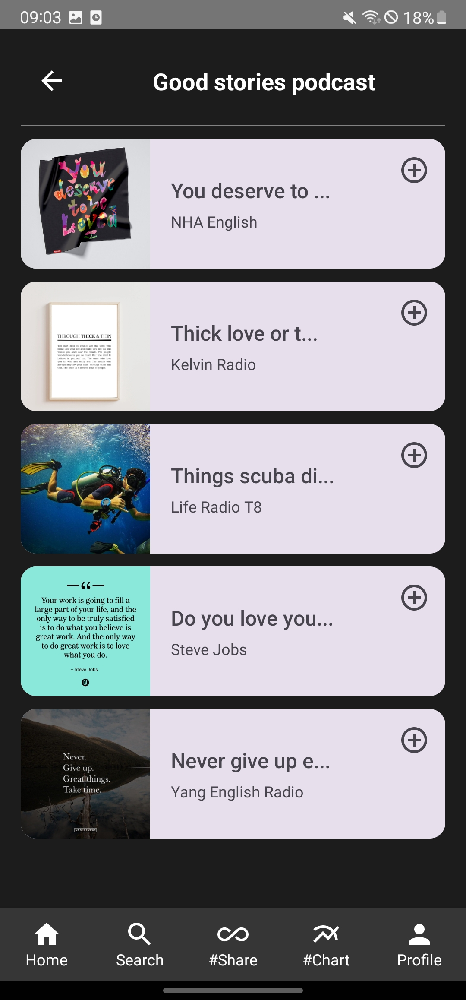
  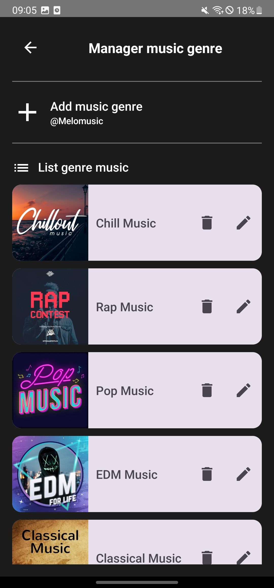
  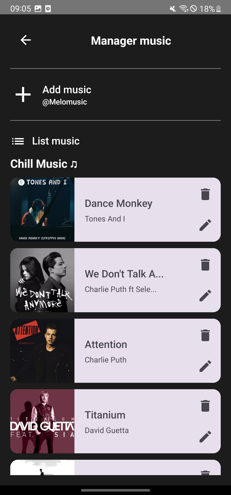
</p>

<p align="center">
  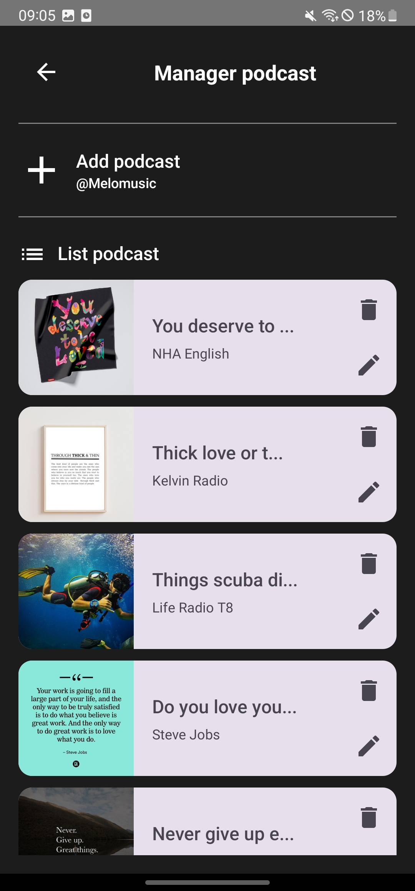
</p>

## ✉️ Contact
- Project: MELO Music App  
- Developer: hongan.dev  
- Email: hongan.dev@gmail.com

Thank you for your interest! If you want, I can also help write a detailed Firebase setup guide, design a Firestore schema, or generate seed/sample data to get the app running quickly.
